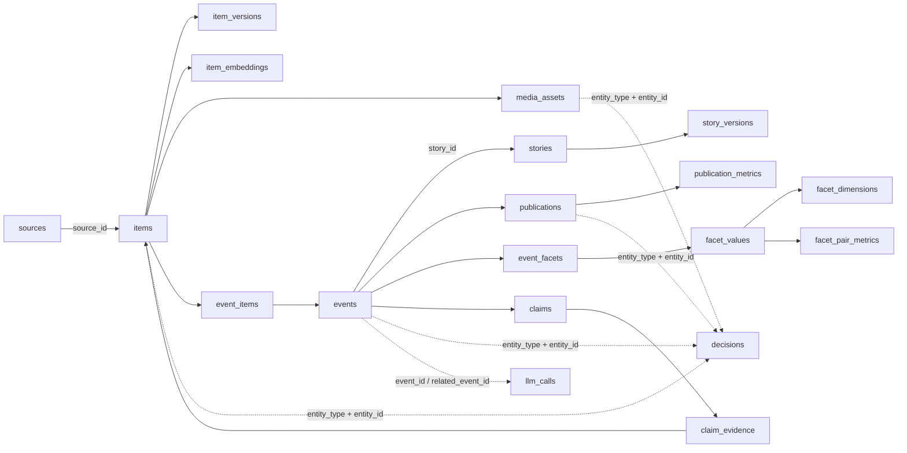

# База даних newsroom: таблиці, зв’язки та аудит шляху новини

Цей документ описує логічну схему поточної PostgreSQL-бази. ORM-моделі є в
`newsroom/models/`, а додаткові безпечні зміни для вже створеної бази — у
`newsroom/db/base.py`.

## 1. Головне правило про ідентифікатори

`items.id`, `events.id`, `publications.id` та інші `id` — це різні простори
ідентифікаторів. Число `2046` саме по собі нічого не означає без назви таблиці.

Таблиця `decisions` є універсальним журналом. Вона не має окремого `event_id`, бо
однаково журналює рішення щодо різних типів сутностей:

- `entity_type='item'`, `entity_id='2333'` означає `items.id=2333`;
- `entity_type='event'`, `entity_id='2046'` означає `events.id=2046`;
- `entity_type='publication'`, `entity_id='109'` означає `publications.id=109`;
- `entity_type='media_asset'`, `entity_id='456'` означає `media_assets.id=456`.

`decisions.entity_id` має тип `text`, тому при ручному JOIN потрібне приведення
`id::text`. Це поліморфний логічний зв’язок, а не фізичний foreign key.

## 2. Основний шлях даних



Звичайний життєвий цикл:

1. `sources` → колектор створює `items`.
2. Фільтрація та embedding залишають рішення на рівні `item`.
3. `event_items` приєднує один або кілька Item до `events`.
4. Класифікація, verify, ingest-dedup, StoryUpdater і curation залишають рішення на
   рівні `event`.
5. Генератор створює `publications` зі статусом `draft`.
6. Prepublish-dedup, очікування медіа і фактичне надсилання журналюються переважно на
   рівні `publication`.
7. Лише `publications.status='published'` достовірно означає, що пост був відправлений.

## 3. Як від Event дійти до всіх Decisions

Прямі Event-рішення:

```sql
SELECT *
FROM decisions
WHERE entity_type = 'event'
  AND entity_id = '2046'
ORDER BY created_at, id;
```

Фінальні рішення публікації лежать через проміжну таблицю `publications`:

```sql
SELECT d.*, p.event_id
FROM publications p
JOIN decisions d
  ON d.entity_type = 'publication'
 AND d.entity_id = p.id::text
WHERE p.event_id = 2046
ORDER BY d.created_at, d.id;
```

Повний аудит Event, включно з його Item, медіа та публікаціями:

```sql
WITH scopes AS (
    SELECT e.id AS event_id, 'event'::text AS entity_type, e.id::text AS entity_id
    FROM events e WHERE e.id = 2046

    UNION ALL
    SELECT p.event_id, 'publication', p.id::text
    FROM publications p WHERE p.event_id = 2046

    UNION ALL
    SELECT ei.event_id, 'item', ei.item_id::text
    FROM event_items ei WHERE ei.event_id = 2046

    UNION ALL
    SELECT ei.event_id, 'media_asset', ma.id::text
    FROM event_items ei
    JOIN media_assets ma ON ma.item_id = ei.item_id
    WHERE ei.event_id = 2046
)
SELECT d.*, scopes.event_id
FROM scopes
JOIN decisions d
  ON d.entity_type = scopes.entity_type
 AND d.entity_id = scopes.entity_id
ORDER BY d.created_at, d.id;
```

Те саме робить утиліта:

```powershell
python -m scripts.trace_events --event 2046
```

## 4. Значення полів `decisions`

| Поле | Значення |
|---|---|
| `entity_type` | Таблиця/тип сутності: фактично використовуються `item`, `event`, `publication`, `media_asset`. |
| `entity_id` | Первинний ID відповідної сутності, збережений як текст. |
| `stage` | Етап: наприклад `filter`, `cluster`, `ingest_dedup`, `classify`, `verify`, `edit`, `predup`, `media`, `publish`. |
| `decision` | Результат етапу: `confirmed`, `curate_publish`, `draft_ok`, `predup_separate`, `published` тощо. |
| `reason` | Коротка людиночитна причина, якщо етап її надає. |
| `details` | Повний структурований контекст рішення у JSONB. |
| `score` | Числова оцінка, зміст якої залежить від `stage`: confidence дедупу, popularity score курації тощо. |
| `ref_id` | Пов’язана сутність, зміст залежить від `stage`. Для dedup це зазвичай ID Event-кандидата. Це не FK. |
| `model` | Модель або назва детермінованого алгоритму, який ухвалив рішення. |
| `charter_version`, `prompt_version` | Версії правил, за якими ухвалене рішення. |
| `created_at` | Час рішення. Для відтворення шляху сортувати також за `id`. |

Не можна JOIN-ити `ref_id` до однієї фіксованої таблиці без урахування `stage`.

## 5. Довідник таблиць

### Сирий шар

#### `sources`

Реєстр джерел. Ключові поля: `kind`, `handle_or_url`, `name`, `origin`, `tier`,
`is_official`, `active`, стан останнього опитування. Зв’язки: `sources.id → items.source_id`,
`source_metrics.source_id`, `reputation_events.source_id`; опційно
`events.first_source_id`.

#### `items`

Незмінний вхідний матеріал з конкретного джерела. Містить текст, URL, source publish
time, `content_hash`, `simhash`, Telegram `forwarded_from/grouped_id` і стан обробки.
Зв’язки: до Event через `event_items`; до медіа, версій, embeddings, метрик і сутностей.

#### `item_versions`

Історія змін тексту Item. FK: `item_id → items.id`.

#### `media_assets`

Фото/відео/embed конкретного Item. `storage_key` з’являється після завантаження;
`download_status` описує чергу, `phash` використовується для пошуку повторного медіа.
FK: `item_id → items.id`.

#### `item_embeddings`

Вектор Item для кластеризації та пошуку кандидатів. Унікальна пара `(item_id, model)`.

#### `entities`, `item_entities`

Канонічні особи/організації/місця та M:N-зв’язок із Item. Поточний основний шлях
фасетів працює через `event_facets`; ці таблиці можуть бути незаповнені.

### Аналітичний шар

#### `events`

Одна конкретна новинна подія, агрегована з одного чи кількох Item. Основні групи полів:

- належність до сюжету: `story_id`;
- стан перевірки: `status`, `risk_level`, `independent_source_count`;
- результат класифікації: `rubric`, `side`, `is_first_source`, `is_rumor`, `keywords`;
- зміст: `compact_facts`, `fact_base`;
- теми: `topic_path`, `topic_leaf_id`, фасети через `event_facets`;
- редакційне рішення: `curated=publish|hold`;
- дедуп: `duplicate_of`;
- тип оновлення сюжету: `update_type`.

`events.status='confirmed'` не означає “опубліковано”. Це лише рівень підтвердження.
`curated='publish'` означає, що редактор допустив створення чернетки. Фактичний стан
надсилання потрібно дивитися в `publications.status`.

#### `event_items`

M:N-зв’язок між Event та Item. `role` описує внесок (`origin`, `copy`, `reaction`,
`official`, `evidence`), `similarity` — близькість під час кластеризації.

#### `stories`, `story_versions`

Story об’єднує різні, але пов’язані Event в довгий сюжет. `story_versions` зберігає
історію summary; `reason_event_id` показує Event, який спричинив нову версію.

#### `taxonomy_nodes`

Самонавчальне дерево `topic_path`. `parent_id` посилається на цю саму таблицю.
`heat`, `demand`, `event_count` — агреговані метрики вузла. `events.topic_leaf_id`
логічно посилається на leaf-вузол, але фізичного FK зараз немає.

#### `facet_dimensions`, `facet_values`, `event_facets`

Фіксовані осі (`event_type`, `geography`, `actor` тощо), data-driven значення всередині
осей і підтверджене текстом присвоєння значень Event. `event_facets.source_item_id`
вказує Item-доказ, якщо він відомий.

#### `facet_pair_metrics`

Часові метрики спільної появи двох facet values. Пара `facet_a_id/facet_b_id` — не
онтологічний зв’язок, а статистична co-occurrence.

#### `claims`, `claim_evidence`

Твердження Event та докази до них. Evidence може вказувати на внутрішній `item_id` або
зовнішній `external_ref`; `stance` — `supports/refutes/neutral`.

### Публікація й метрики

#### `publications`

Чернетка або фактичний вихід у канал. FK: `event_id → events.id`;
`reply_to_publication_id → publications.id`. Важливі поля:

- `status`: `draft`, `publishing`, `published`, `review`, `superseded`, `ambiguous`,
  `edited`, `retracted`, `deleted`;
- `channel_ref`: ID повідомлення в Telegram після успішної відправки;
- `headline`, `body`, `features`: готовий текст і результат критика;
- `has_media`, `media_status`, лічильники та `media_approved_at`: стан підготовки медіа;
- `published_at`: час підтвердженої відправки.

#### `publication_metrics`

Знімки переглядів, реакцій, пересилань і коментарів нашої публікації.

#### `channel_metrics`

Знімки кількості підписників нашого каналу. Не має FK, бо канал задається рядком.

#### `item_metrics`, `source_metrics`

Метрики чужих матеріалів і розміру їхніх джерел. На них базується demand intelligence.

### Сервісний та аудиторський шар

#### `reputation_events`

Події репутації джерела: first/confirmed/refuted/copy тощо. Має FK на Source і
опційні Event та Item.

#### `decisions`

Поліморфний журнал бізнес-рішень. Для нього немає FK на цільову сутність; завжди
використовувати пару `(entity_type, entity_id)`.

#### `llm_calls`

Телеметрія викликів моделей: операція, токени, cached tokens, ціна, тривалість,
обрізані request/response. `event_id` — основний Event, `related_event_id` — Event,
з яким його порівнювали; `context` містить batch/item/source IDs. Ці поля логічні,
без фізичних FK, щоб збій телеметрії не блокував pipeline.

#### `system_state`

JSON key-value control plane: службові прапорці, кеші, stop state та інший стан, який
не потребує окремої таблиці.

## 6. Поля, які легко сплутати

| Поле | Не означає | Насправді означає |
|---|---|---|
| `events.status` | Стан Telegram-поста | Рівень підтвердження інформації. |
| `events.curated` | Пост уже відправлено | Curation дозволила або заборонила створення поста. |
| `events.duplicate_of` | Story | Канонічний Event-дубль; Story задається `story_id`. |
| `items.published_at` | Час нашої публікації | Час матеріалу у джерелі. |
| `publications.created_at` | Час надсилання | Час створення чернетки. |
| `publications.published_at` | Час джерела | Час фактичного надсилання в наш канал. |
| `decisions.score` | Універсальна ймовірність | Stage-specific число; читати разом зі `stage/details`. |
| `decisions.ref_id` | Завжди Event FK | Stage-specific посилання, найчастіше dedup-кандидат. |
| `events.first_source_id` | Повний список джерел | Лише опційне перше джерело; повний список через `event_items → items → sources`. |

## 7. Практичні запити

Усі джерела Event:

```sql
SELECT s.id, s.name, s.tier, s.is_official, i.id AS item_id, ei.role, i.url
FROM event_items ei
JOIN items i ON i.id = ei.item_id
JOIN sources s ON s.id = i.source_id
WHERE ei.event_id = 2046;
```

Публікація й Telegram message ID:

```sql
SELECT id AS publication_id, event_id, status, channel_ref, created_at, published_at
FROM publications
WHERE event_id = 2046
ORDER BY id;
```

LLM-витрати конкретного Event, включно з pairwise dedup:

```sql
SELECT *
FROM llm_calls
WHERE event_id = 2046 OR related_event_id = 2046
ORDER BY created_at, id;
```

Curation-виклик може бути пакетним, тому його `event_id` іноді NULL, а список Event
лежить у `context->'event_ids'`:

```sql
SELECT *
FROM llm_calls
WHERE op = 'curate'
  AND context->'event_ids' @> '[2046]'::jsonb
ORDER BY created_at, id;
```
